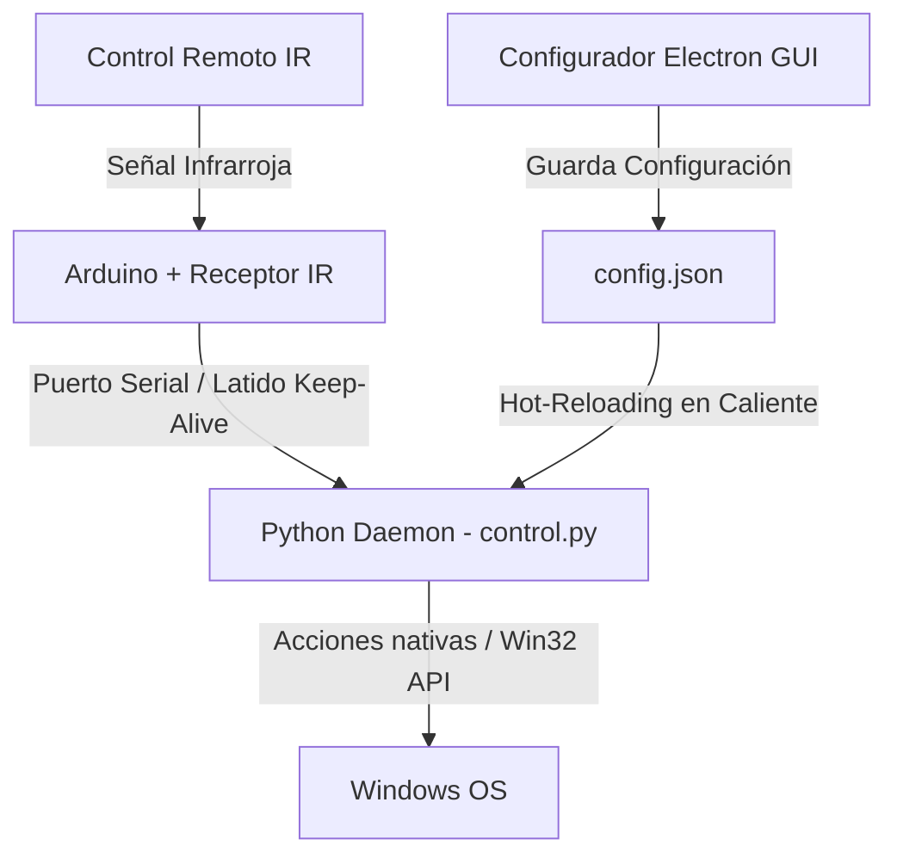

# InfraDeck: Custom Infrared Macro Pad

**InfraDeck** es un proyecto sencillo para controlar tu computadora con Windows usando un control remoto infrarrojo (IR) común y una placa Arduino. 

Consiste en un script de Python que escucha el puerto serial para recibir los códigos del control remoto y ejecuta las acciones que tengas configuradas, complementado con una interfaz gráfica en Electron para asignar los botones visualmente.

---

## ¿Qué se puede hacer?

El proyecto te permite mapear los botones de tu control remoto para realizar diferentes tareas en Windows:

*   **Controles Multimedia:** Subir/bajar volumen, silenciar audio, pausar, reproducir o cambiar de canción.
*   **Toggle de Steam:** Si Steam no está abierto, lo inicia. Si está abierto pero minimizado/en la bandeja, lo trae al frente. Si la ventana está visible en pantalla, la envía de vuelta a la bandeja del sistema.
*   **Toggle de WhatsApp:** Si WhatsApp está cerrado, lo abre. Si está minimizado, lo restaura a primer plano. Si está activo en pantalla, lo minimiza para limpiar tu espacio de trabajo.
*   **Control de Discord:** Macros directas para mutear el micrófono (`F7`) o ensordecer el audio (`F8`).
*   **Lanzar Aplicaciones y Webs:** Abrir tus navegadores favoritos con perfiles específicos, lanzar juegos o abrir programas de desarrollo.
*   **Configuración Visual (GUI):** Una interfaz gráfica en Electron para no tener que editar archivos de texto a mano. Te permite arrastrar archivos `.exe` directamente sobre los botones o escribir URLs para asignarlos al instante.

---

## Cómo Funciona

El flujo de comunicación es directo y sencillo:



1.  **Arduino:** Recibe la señal del control IR a través del sensor, decodifica el código hexadecimal y lo envía por puerto serial.
2.  **Daemon de Python (`control.py`):** Lee constantemente el puerto serial en segundo plano. Cuando llega un código, ejecuta la acción asociada en tu configuración.
3.  **Configurador (Electron GUI):** Modifica el archivo `config.json`. El script de Python detecta los cambios automáticamente y se actualiza al instante sin necesidad de reiniciarlo.

---

## Diagrama de Conexiones

El circuito en la protoboard utiliza tres cables básicos. El receptor IR (TSOP38238 o similar) está conectado a la alimentación de **5V**, **GND** y el pin de señal está conectado al **Digital Pin 10** del Arduino Uno.

![Esquema de conexiones del circuito]


---

## Mapeo del Control Remoto (Matriz 7x3)

Si usas el control remoto estándar de 21 botones (habitual en los kits de Arduino), la correspondencia de las teclas físicas (leídas en orden de arriba a abajo y de izquierda a derecha) con sus códigos hexadecimales es la siguiente:

| Fila | Columna 1 (Izquierda) | Columna 2 (Centro) | Columna 3 (Derecha) |
| :---: | :---: | :---: | :---: |
| **Fila 1** | `BA45FF00`<br>(Prev) | `B946FF00`<br>(Pause) | `B847FF00`<br>(Next) |
| **Fila 2** | `BB44FF00`<br>(Vol-) | `BF40FF00` / `B740FF00`<br>(Vol+) | `BC43FF00`<br>(Mute) |
| **Fila 3** | `F807FF00`<br>(Menos `-`) | `EA15FF00`<br>(Más `+`) | `F609FF00`<br>(EQ) |
| **Fila 4** | `E916FF00`<br>(Botón `0`) | `E619FF00`<br>(Botón `100+`) | `F20DFF00`<br>(Botón `200+`) |
| **Fila 5** | `F30CFF00`<br>(Botón `1`) | `E718FF00`<br>(Botón `2`) | `A15EFF00`<br>(Botón `3`) |
| **Fila 6** | `F708FF00`<br>(Botón `4`) | `E31CFF00`<br>(Botón `5`) | `A55AFF00`<br>(Botón `6`) |
| **Fila 7** | `BD42FF00`<br>(Botón `7`) | `AD52FF00`<br>(Botón `8`) | `B54AFF00`<br>(Botón `9`) |

> [!IMPORTANT]
> **Botones Especiales y Scripts Reservados (Reemplazar con cuidado):**
> La distribución de tu control remoto incluye botones especiales que ejecutan lógica nativa avanzada en Python para alternar entre estados (minimizar/restaurar). Se recomienda **no** reescribirlos con rutas normales de aplicaciones o URLs para conservar su funcionamiento de alternancia rápida:
> *   **Botón 2 (Steam - `E718FF00`):** Llama a `toggle_steam` (Abre Steam o lo minimiza/restaura de la bandeja del sistema).
> *   **Botón 3 (WhatsApp - `A15EFF00`):** Llama a `toggle_whatsapp` (Abre WhatsApp o lo minimiza/restaura).
> *   **Botón 9 (Configurador - `B54AFF00`):** Llama a `toggle_editMacroPad` (Abre o cierra la interfaz gráfica de Electron).
> *   **Botón 0 (Mute Discord - `E916FF00`):** Llama a `mutear_discord` (Mutea tu micrófono globalmente).
> *   **Botón EQ (Ensordecer Discord - `F609FF00`):** Llama a `ensordecer_discord` (Ensordece el audio globalmente).

![Visualización UI]

---

## Estabilidad y Conexión

Para evitar tener que desconectar el cable o reiniciar el script constantemente en el uso diario, se añadieron algunas lógicas de control básicas:
*   **Reset de receptor IR:** Si el sensor recibe interferencias (ruido electromagnético o luz) y deja de responder, el Arduino reinicia el módulo por software automáticamente cada 2 segundos (durante su latido "PING") para volver a escuchar señales válidas.
*   **Reconexión USB:** Si la conexión serial se congela o el puerto USB falla, el script de Python intenta deshabilitar y volver a habilitar el dispositivo COM usando la herramienta `pnputil` de Windows para restablecer el canal.
*   **Aislamiento de tareas:** Las acciones lentas (como abrir un juego pesado) se ejecutan en hilos separados para que el script pueda seguir escuchando las pulsaciones del control de inmediato.

---

## nstalación y Configuración

### 1. Cargar el Firmware en Arduino
Sube el archivo `.ino` de la carpeta `/arduino` a tu placa usando el IDE de Arduino. Asegúrate de instalar previamente la biblioteca `IRremote` (versión v4.x).

### 2. Configurar el Demonio en Python
Instala las bibliotecas necesarias:
```bash
pip install pyserial keyboard watchdog
```
Ejecuta el script para empezar a escuchar el puerto:
```bash
python control.py
```
*(Nota: El script de Python debe configurarse con el puerto correcto de tu Arduino, por ejemplo `COM3`).*

### 3. Ejecutar la Interfaz de Electron
Instala las dependencias de Node e inicia el configurador:
```bash
npm install
npm start
```

---

## Automatización y Ejecución Silenciosa

Para dejar el programa corriendo en segundo plano sin que se muestre una ventana de comandos en tu pantalla y configurarlo al arrancar Windows:

### 1. Archivos de Arranque Oculto
Crea estos dos archivos en la carpeta de tu proyecto para ejecutar el script sin mostrar la consola:

*   **`arranque.bat`:**
    ```batch
    @echo off
    cd /d "tu/ruta/al/proyecto"
    python control.py
    ```
*   **`lanzador_silencioso.vbs`:**
    ```vbs
    Set WshShell = CreateObject("WScript.Shell")
    WshShell.Run chr(34) & "tu/ruta/al/proyecto/arranque.bat" & Chr(34), 0
    Set WshShell = Nothing
    ```

### 2. Iniciar con Windows (`taskschd.msc`)
Para arrancar el programa de forma automática y con los permisos necesarios para realizar los reinicios de puerto COM:
1.  Abre el Programador de Tareas (`taskschd.msc`).
2.  Crea una tarea programada para ejecutarse **"Al iniciar sesión"** de tu usuario.
3.  Establece la acción para iniciar el programa apuntando a tu archivo `lanzador_silencioso.vbs`.
4.  En los ajustes de la tarea:
    *   Marca la opción **"Ejecutar con los privilegios más altos"** (Administrador).
    *   Activa la casilla **"Oculta"**.
    *   En la pestaña de *Condiciones*, desmarca *"Iniciar la tarea solo si el equipo está conectado a la corriente"* (para laptops).

### 3. Botón de Pánico: Reinicio directo a la BIOS
Si quieres asignar un botón de tu control para reiniciar directamente en la BIOS/UEFI de tu placa, puedes configurar una macro que llame al siguiente archivo ejecutable:

*   **`reinicio_bios.bat`:**
    ```batch
    @echo off
    shutdown /r /fw /t 0
    ```

---

## Estructura del Archivo `config.json`

El archivo de configuración tiene el siguiente formato y utiliza rutas relativas o absolutas configurables desde la interfaz gráfica:

```json
{
    "BA45FF00": {
        "nombre": "Prev: Retroceder Canción",
        "tipo": "tecla",
        "valor": "previous track"
    },
    "E718FF00": {
        "nombre": "2: Toggle Steam",
        "tipo": "script",
        "valor": "toggle_steam"
    },
    "EA15FF00": {
        "nombre": "Más (+): Abrir App",
        "tipo": "app",
        "valor": "C:\\tu\\ruta\\aqui\\programa.exe"
    },
    "F30CFF00": {
        "nombre": "1: YouTube",
        "tipo": "web",
        "valor": "https://www.youtube.com"
    }
}
```

---


